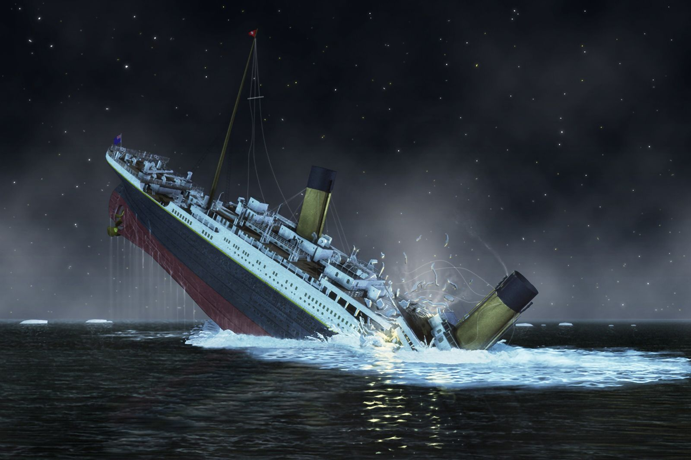

<h1 align="center"> Titanic - Machine Learning </h1>

Competição "Titanic - Machine Learning from Disaster", promovido pelo Kaggle 

  <a href="#-tecnologias">Tecnologias</a>&nbsp;&nbsp;&nbsp;|&nbsp;&nbsp;&nbsp;
  <a href="#-projeto">Projeto</a>&nbsp;&nbsp;&nbsp;|&nbsp;&nbsp;&nbsp;
  <a href="#-desafio">Desafio</a>&nbsp;&nbsp;&nbsp;|&nbsp;&nbsp;&nbsp;

  

https://github.com/pereiralaura/projeto01-analise-titanic

 

  

## 🚀 Tecnologias

Esse projeto foi desenvolvido com as seguintes tecnologias:

- Python
- Github

## 💻 Projeto

Esta competição consiste em descobrir, através do Python, que tipos de pessoas têm maior probabilidade de sobreviver a essa trágedia, usando dados de passageiros (ou seja, nome, idade, sexo, classe socioeconômica, etc.). 

 
[Participe da competição também] (https://www.kaggle.com/competitions/titanic)

## 🔖 Desafio

O naufrágio do Titanic é um dos naufrágios mais infames da história.

Em 15 de abril de 1912, durante sua viagem inaugural, o RMS Titanic, amplamente considerado “inafundável”, afundou após colidir com um iceberg. Infelizmente, não havia botes salva-vidas suficientes para todos a bordo, resultando na morte de 1.502 dos 2.224 passageiros e tripulantes.

Embora houvesse algum elemento de sorte envolvido na sobrevivência, parece que alguns grupos de pessoas tinham maior probabilidade de sobreviver do que outros.

Neste desafio, pedimos-lhe que construa um modelo preditivo que responda à pergunta: “que tipos de pessoas têm maior probabilidade de sobreviver?” usando dados de passageiros (ou seja, nome, idade, sexo, classe socioeconômica, etc.).

Você pode visualizar o desafio através [DESSE LINK](https://www.kaggle.com/competitions/titanic).

---

Feito com ♥ :wave:
